# 克隆与推送自己的分支

## 一、将本项目 **克隆** 到本地。

1. 找到项目的地址

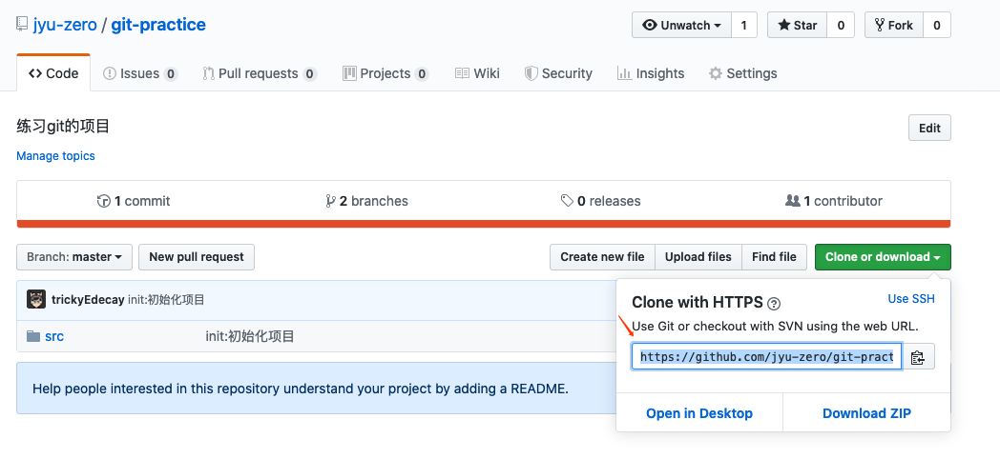

2. clone 至本地

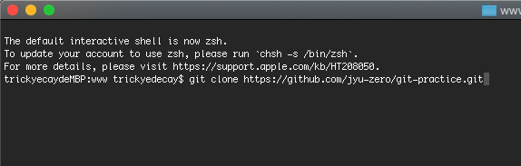

3. 在 vs code 中打开，确认一下它默认选中的分支

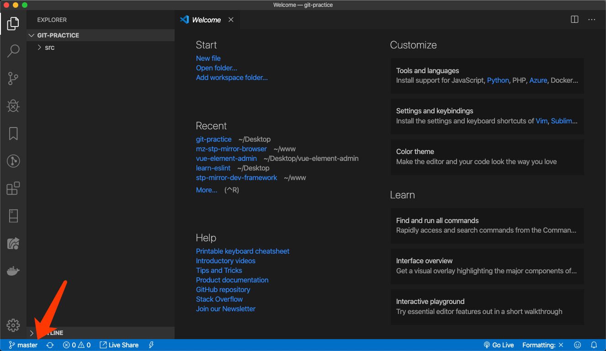

4. 将分支切换为 `dev` 分支

实际上，你的本地分支并没有 `dev` 分支，所以应该选择 `origin/dev` 分支，这个分支代表的是将远程的 `dev` 分支拉取下来。

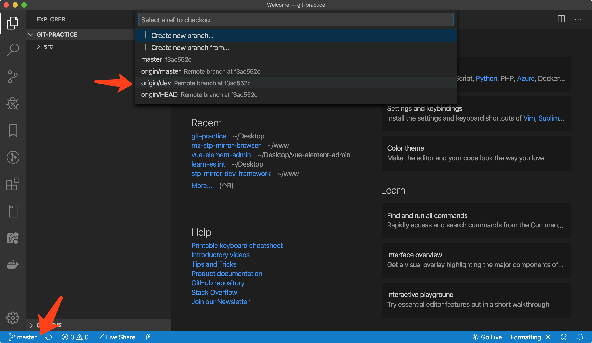

如果你用的是 `phpstorm` ，操作如下：

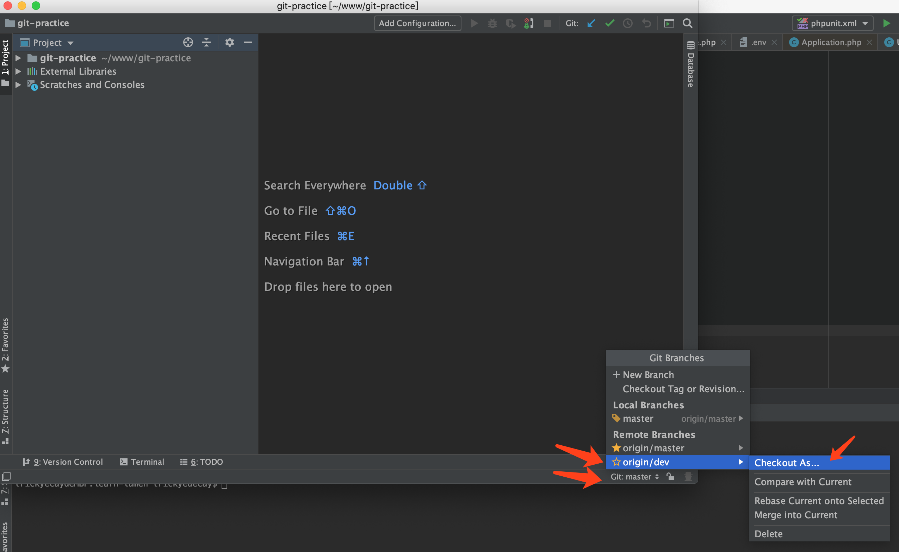

`phpstorm` 他会询问你要将远程的 `dev` 分支拉取到本地并命名为什么分支，这里我们保持原名就可以了。

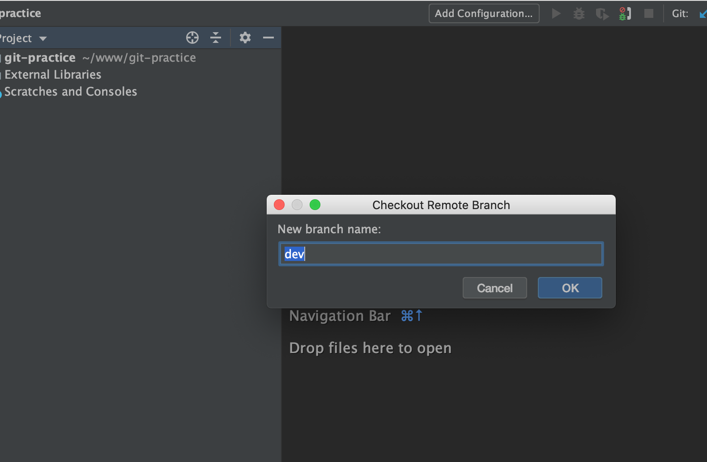

## 二、创建自己的分支

注意，创建自己的分支之前，你一定得先确认当前的分支是处于 `dev` 分支。

> 如果你现在是处在正确的 `dev` 分支，你应当会在 `src/index.html` 文件上看到一句话： `这里是 dev 分支`

那么接下来，我们要创建自己的分支啦。

首先问一下你自己，叫什么名字，比如我叫 `tricky`。那么我给自己的分支命名为 `feat-tricky`


### 对于 vscode 而言：

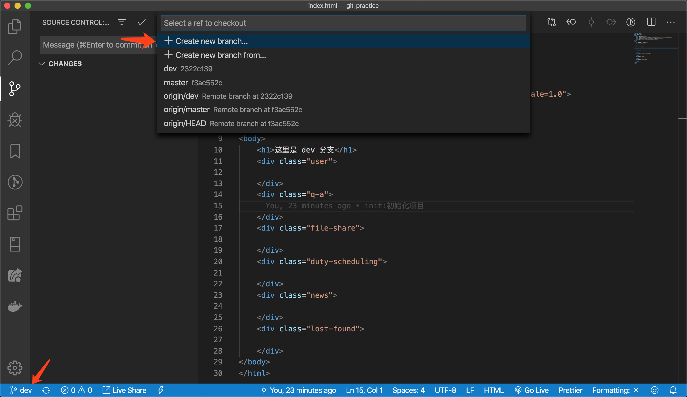

他这里有两个选项：
- create new branch: 基于当前的分支来创建新的分支
- create new branch from: 基于你选择的分支来创建新的分支

我们选择第一个，因为我们当前已经是 dev 分支了。

接下来填写新分支的名字，然后敲击**回车键**。
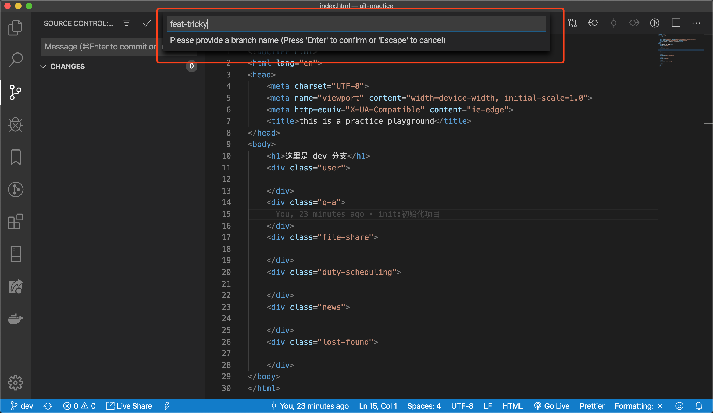

看！我们现在已经在自己的分支上了：
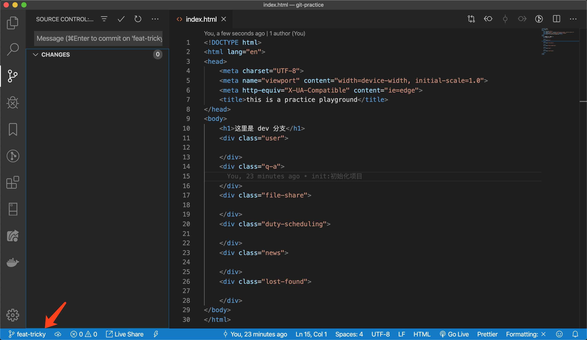

### 对于 phpstorm 而言：

> 再三确认你当前的分支是在 dev 分支！

点击右下角的分支按钮->New Branch：
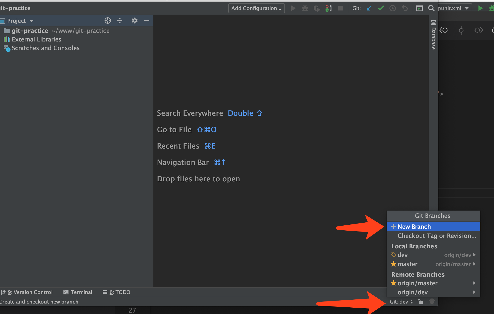

他要求我们填写分支名字，我们按照约定好的规则填写：
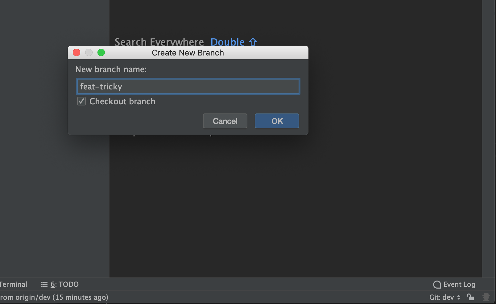

> 它底下有个 ☑️ checkout branch ，意思是当你勾上的时候它会在创建完之后切换到该分支上，不勾的话就还是保留在你所在的分支上。所以我们勾上。

## 三、做一些修改

这也是今天任务的重点，你们需要在自己的分支上做一些事情，例如，在 `src/index.html` 上，在你所在的分组的 `div` 内创建一个 `div` 并写上你的名字，就像我这样：

```html
<body>
    <h1>这里是 dev 分支</h1>
    <div class="example">
        <div>tricky</div> <!--哝，我是属于这个分组的-->
    </div>
    <div class="user">

    </div>
    <div class="q-a">

    </div>
    <div class="file-share">

    </div>
    <div class="duty-scheduling">

    </div>
    <div class="news">

    </div>
    <div class="lost-found">

    </div>
</body>
```

接下来，在 `/src` 文件夹找到你所处的分组，并且在里面创建一个以自己名字命名的文件，像我这样：
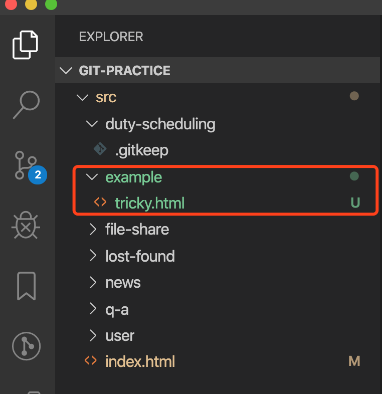

## 四、进行 add->commit
这一步我就不多说了，上课讲了很多次了，无论是 vscode 还是 phpstorm，都差不多
不过注意的是你的 commit message，一定要按照我们约定的格式来，比如我写的是：
```
chore:完成tricky的练习任务
```

## 五、将自己的分支 push 到远程仓库上

完成了 commit 之后，我们需要将自己的分支 push 到远程仓库上。

### 对于 vscode

在 git 面板找到 `push`
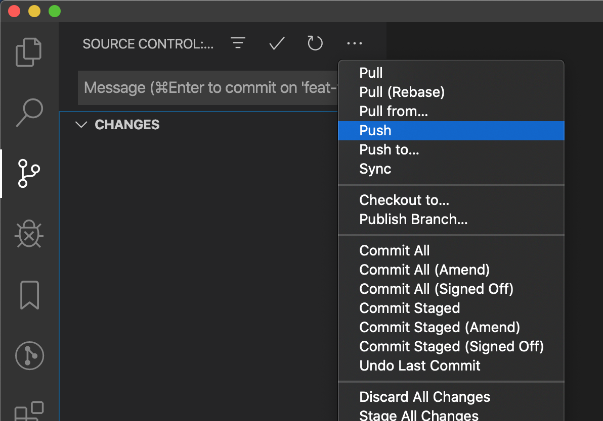

点击之后他会弹出这个窗口：
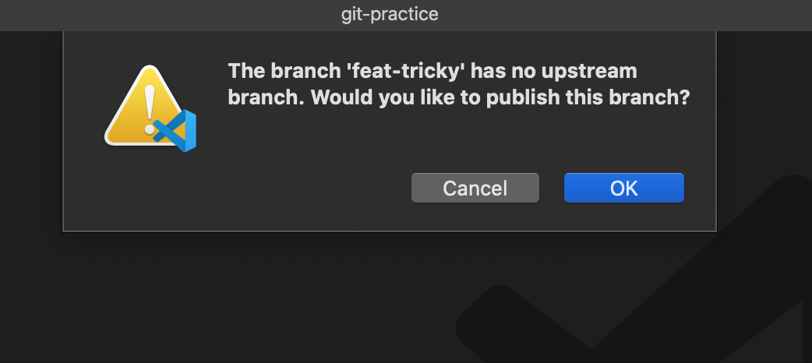

意思是当前的这个分支啊，他不知道该往远程的哪个分支上去推送，你真的要推送吗？点OK。

然后弹出的这个面板是确认一下你要往哪个远程主机上进行推送，那我们肯定是选 `origin`，
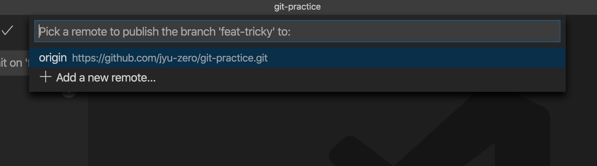

> 刚刚出了 `push`按钮，还有另一个按钮是 `push to`，意思就是能够让你选择要上传的远程主机到底是哪一台


成功后我们就会在 github 上看到自己的分支啦~
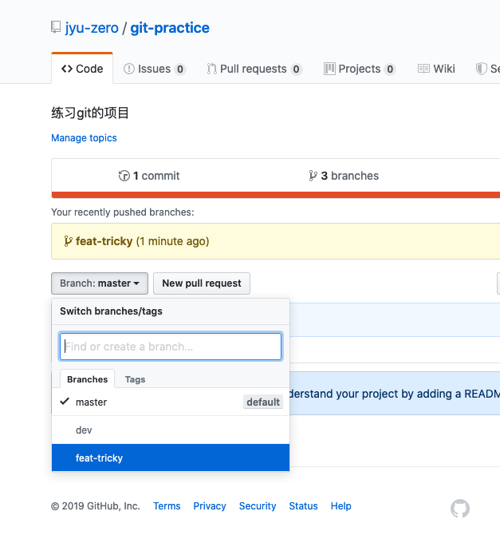


### 对于 phpstorm 而言

找到 `VCS->Git->Push` 进行 push
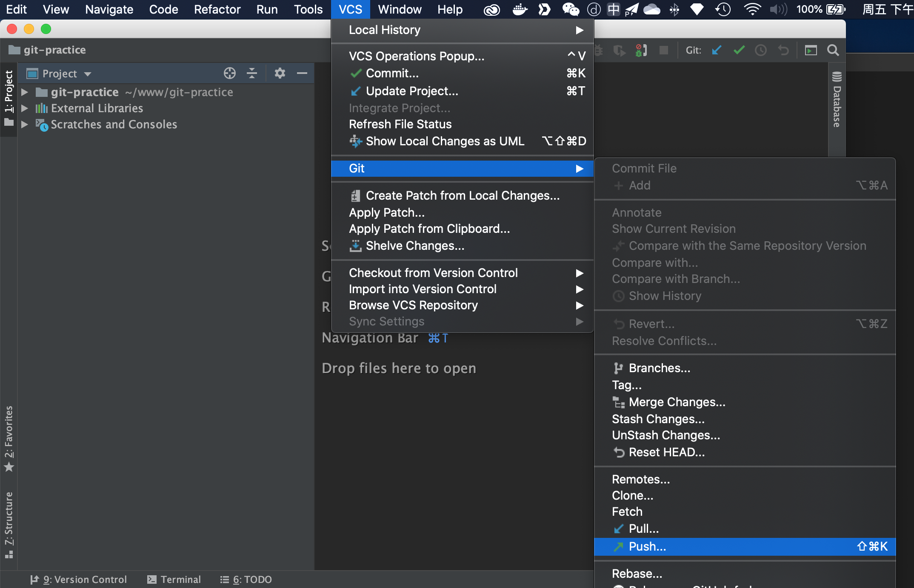

在弹出来的面板中，它尝试告诉你，你正在试图从本地的 `feat-tricky` 分支，推送到远程的 `feat-tricky` 分支。
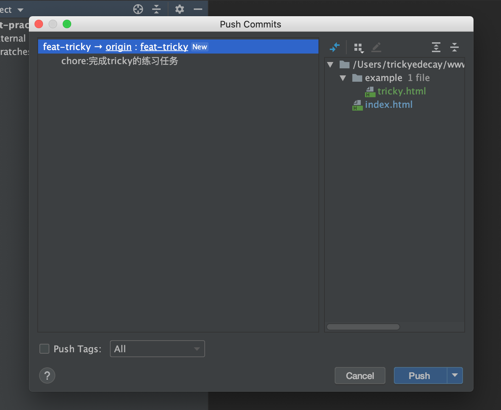
由于我们远程还没有属于你名字的分支，所以，会有个 `new` 的图标跟在后面，代表他会帮你创建一个同名的远程分支。

点击 `push` 完成！


**完结撒花！🎉🎉**