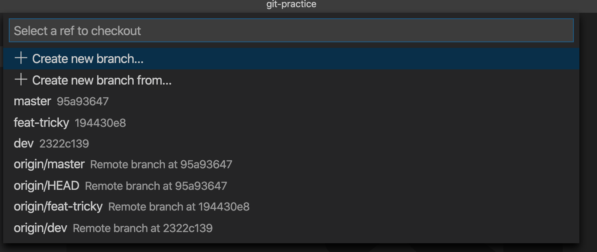

# 更新自己的本地远程分支列表

在上一次任务当中，几乎每一个参与的人都创建了属于自己的分支。

但是当你打开 vscode 或 phpstorm 时，却发现本地记录的只有你上一次看到的那些分支。



我们知道，这些以 `origin/` 开头的分支都是**远程分支的本地副本**。

如果你想要拉取远程的 master 分支到本地的 master 分支。

实际上它内部的操作是从 `origin/master` 分支将内容搬运到 `master` 分支而已。

## 那问题就来了
如果我现在需要从别的同学的分支上拉东西到本地来，该怎么做呢？

嗯，无论是 `vscode` 还是 `phpstorm` 都没有提供一种图形化的方式让我们更新本地的远程分支列表。

## 那怎么办呢
在当前的项目文件夹下，打开我们的 `cmd` 或者是直接在 `vscode` 或 `phpstorm` 里面打开终端控制，输入以下命令：

```bash
git fetch --prune
```

这样子你就会看到远程分支列表发生了更新，也看得到别人的分支啦~

但是需要注意的是，我们仅仅是更新了远程分支列表，也就是本地并不存在其他同学的同名分支哦。