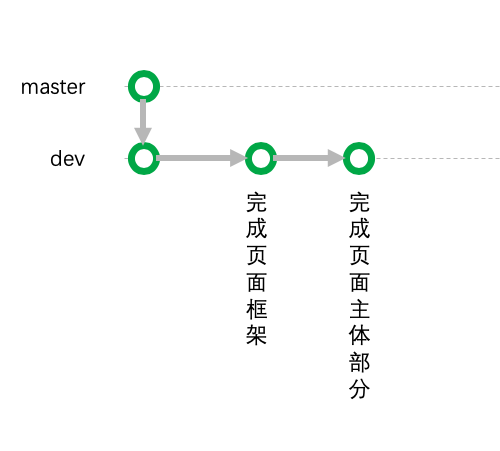
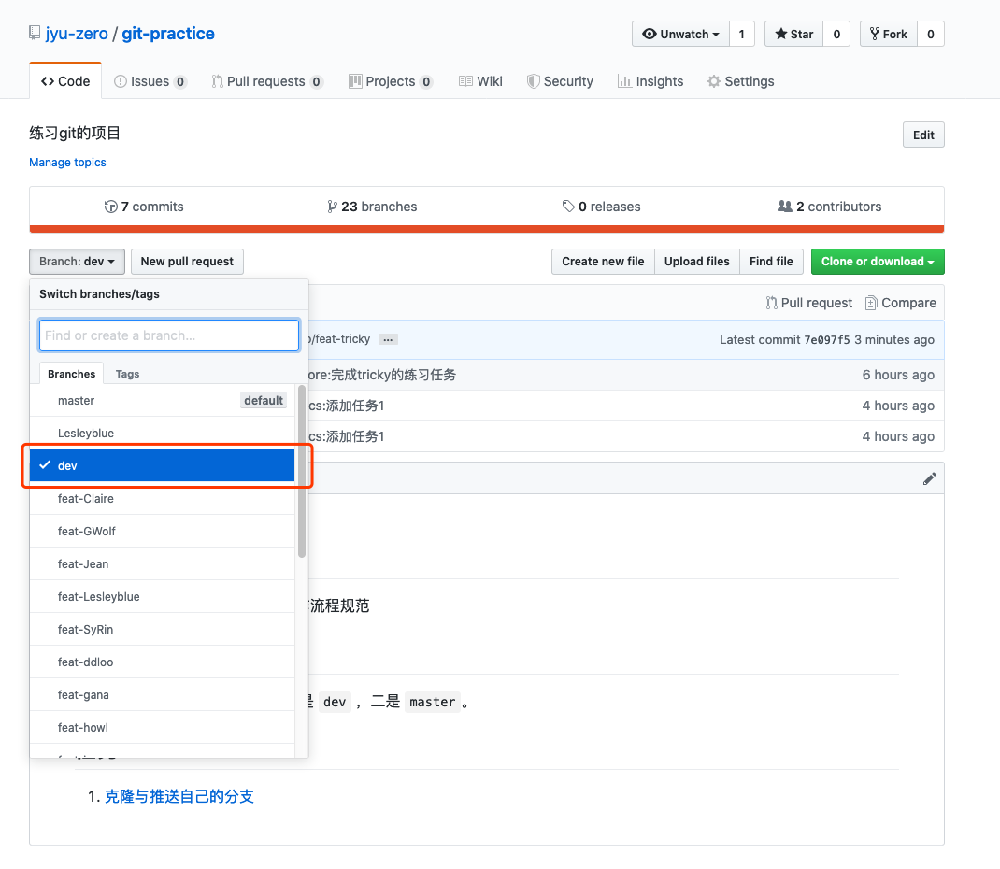

# 请求将自己的分支合并到 dev 分支

我们之所以要在自己的分支上进行开发，是因为你可以在自己的分支上 **为所欲为**。

## 一、事起有因
比如说，你现在在做一个页面，你可以大胆地将页面的开发过程进行细致的分割。

- 完成页面框架设计
- 完成导航栏设计
- 完成页面整体设计

在这个过程中，你爱提交多少次就提交多少次，每个版本目的都很清晰。

而如果每个人直接在 `dev` 分支上开发，那么大家的开发一定会互相影响，你将不能为所欲为。

我举个例子，你和另一个`小伙伴Tony` **同时** 在设计 **同一个** `html` 文件。
你们的分工是这样的:
- 你来搭建整个页面框架
- Tony 来设计导航栏的样子
- 你来设计页面的主体内容

于是乎，你提交了第一个版本，设计了页面的框架：

接下来，你和 Tony 说了，他可以去开发导航栏了，你自己也同时来开发页面的主体内容。

Tony 开发完了，在 `Tony的电脑`上的提交长这样：

你也开发完了，你在 `你自己电脑` 上的提交长这样：

现在，Tony 领先你一步，把代码push到了远程仓库上，所以远程仓库上的提交长这样：

接下来，你说你也要push你的代码上远程仓库了。**结果，git给你报了一个大大的错误！**

这是因为，对于 `git` 而言，它无法理解到底对于 `完成页面框架` 节点之后的下一个节点应该得是谁？

也就是说，我们的 `dev` 分支上出现了一些意见分歧！**分支应该自身是一条完整的直线，而不能再产生分歧了。**

在 git 上真实存在这种情况，相应的解决方法有两种：

- merge: 合并
- rebase: 变基

但这都不是我们这一次任务要关心的内容。

只是通过这个案例，我们知道了在自己分支上做自己的事情会很爽！不会受到其他人的干扰！

## 二、分支工作流程

### 1. 独自开发
每个人都在自己的分支上做着自己的事情，大家互不干扰。

### 2. 适时整合代码
这样子的话，大家做的事情是分散的，我们需要适时地将大家的代码整合起来。

所以当 **每个人认为** 它的工作告一段落了，或者是组长认为已经告一段落了，每个人都应该进行一次 **请求合并**。

请求合并的目的是将你所进行的开发整合到 `dev` 分支上。

远程仓库上的图例：

一般而言，你可以在本地将你所做的所有修改先 **merge** 到 `本地的dev` 分支，然后再将 `本地的dev` 分支 **push** 到 `远程的dev` 分支上。
> 上面这句话可能你会看不懂，但是没关系，因为不影响我们后面的内容。

但很遗憾的是，往往你向 `远程的dev` 分支进行 push 的时候，你会得到一个错误提醒：

因为你没有权限向 `远程的dev` 分支上推送东西。

因为 `远程的dev` 分支上的内容，一是不让大家随便改，二是这些代码功能足够稳定（经过审查）。

### 3. 系统开发完成
一路走下来，我们的 `dev` 分支上会有很多很多的节点，直到我们认为这个系统已经开发完成了，我们才会将 `dev` 分支上的内容整合至 `master` 分支。

在 `master` 分支上的每个节点，都是最稳定的版本，bug最少，功能最齐全，可以面对用户、拿来卖钱了。所以一般我们会很少去动 `master` 分支。

## 三、请求合并

因为我们在 [task1](task1.md) 的时候已经对一些文件做了一些修改，但是这些修改仅仅是体现在你们自己的个人分支上的，所以让现在我们来进行一次 **请求合并** 吧！

### 1. push
你应该先保证你的内容已经 `push` 到远程仓库属于的自己的分支了。
> 推送自己的分支参照 [task1](task1.md)

### 2. 发起PR
到项目主页找到 `New pull request` 按钮，并点击它

### 3. 填写请求合并资料
在打开的页面中有两个内容要你选：
- base: 目标分支，这里由于我们要把内容请求合并至 `dev` 分支，所以要选 `dev`。
- compare: 要合并的分支，我们要把自己的分支选上。

接下来填写一下相关的信息：
- 填写标题：完成了 `{你自己名字}` 的PR
- 填写描述：随便写
> 当然，这标题和描述就算你不小心写错了，后面还能再改~

### 4. 点击那个绿绿的大按钮！
看到上图的那个绿绿的 `create pull request` 按钮了嘛~点击它！

接下来你就可以在 `Pull Request` 面板里看到你发起的**合并请求**啦！

### 5. 等待检查
仔细研究上图，你会发现有一行小字：`review required`。

发起合并请求有一个最直接的好处就是在整合代码之前，组长们可以对你的代码进行确认，确认的内容包括：
- 代码风格：看看你是不是写的乱七八糟啦~
- 业务逻辑：看看你有没有按照预想的完成一个需求啦
- 漏洞错误：看看是不是有一眼就看出来的bug啦
- 优化层面上的东西：看看是不是有组长能辨识出来的可优化空间啦

组长们需要花一些时间才能确保你的代码是安全的、可用的、可以整合至 `dev` 分支上的。

当你提交完一个PR之后，我们可以在你的 PR 详情页中看到：

`Reviewers` 指的就是检查代码的人，每当你发起 PR，在这个地方都会自动出现 `maintainers`，代表的是6个组的组长们。

> 如果你有需要让师兄也看一眼代码，你大可以点击一下 `Reviewers` 右边的小齿轮，以选中师兄的账号~

-- 接着耐心等待你们组长的工作 --

当组长审查完了之后，你会看到：

这里变成了 `Approve` !意思是，你得到了认可，或者说你的代码没有毛病！

还有另一种可能性，是 `Request Changes`，代表着组长发现你的代码有问题，需要你进一步修改。根据组长的要求进行改正，然后通知组长。

> 当你再次修改了代码之后，你无需再次发起 PR ，那个原来的 PR 会记录你新的修改，所以你要做的事情是通知组长你改完了让组长再看一眼。直到出现 `Approve` 为止！

### 6. 被合并了
有些时候，你可能连 `Approve` 都看不到，而是发现你的 PR 直接就不见了。不用担心，这是因为组长在审查完你的代码之后，给了你 `Approve` 之后，顺便把代码给合并到了 `dev` 分支上了！所以PR会自动变成已完成的状态，所以你就看不见，不需要慌张~

组长视角：

当组长点了上面这个绿色按钮，PR就变成已完成状态啦：

### 7. 查看你所做的修改是不是反应在了 dev 分支上

> 当然，这一步需要在经过第6点之后你才能体会到~

到 github 项目主页上切换到 dev 分支

点击一下 `commits`

在众多次的 `commit` 当中找到了我当时的信息还有一次组长的合并：

## 关于我们的项目
在我们的项目中，我们要求你每天至少进行一次 PR ，除非你真的没有完成任何事情。这样有利于项目的良性发展。

**完结撒花！🎉🎉**