# 组长的辛苦

## 一、回顾

我们在 [task1](task1.md) 中大家完成了两项任务：

1. 在 `index.html` 中找到自己的分组并添加自己名字的 `div`
2. 在 `src` 文件夹底下找到自己的分组并且添加自己名字的文件

当你完成了以上修改之后，你进行了一次 `commit`，而这次 `commit` ，是发生在自己的分支上的；并且，在最后你还将自己的分支 push 到了远程仓库上。

足以见得，当时的 `远程仓库` 如果画成图的话，一定长这样：

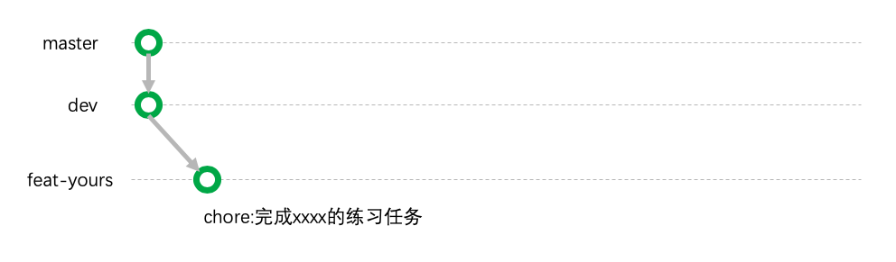

然鹅，偶们滴开发并不是只有你一个人完成了你的作业，其他众多人也完成了他们的作业，所以实际上整个 **远程仓库** 的流程看起来应该像这样：
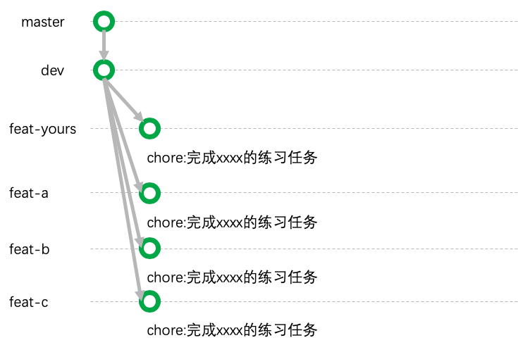

> 下文我将用 `feat-yours` 来代表这是**属于你的分支**

从上图大家应该理解一个点：就是所有人所做的修改，都是基于 `dev` 分支的那一个版本的进行的。

后来呢，我们的 [task3](task3.md) 又让大家发起 `PR` ，请求将你做的事情合并到 `dev` 分支上，这个过程经历了：

- 你发起了PR
- 组长审核了你的代码
- 组长将你的代码合并到 `dev` 分支上

当你的代码被合并到 `dev` 分支上时， **远程仓库** 看起来就像这个样子：
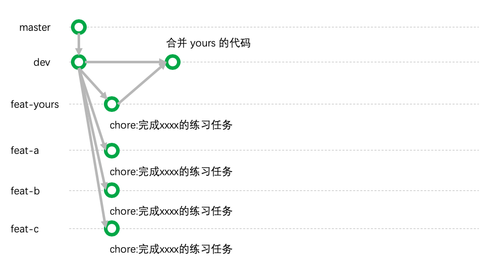

然鹅，我们每一个人都 **非常认真** 的完成了作业，所以 **远程仓库** 实际上看起来应该像这样：
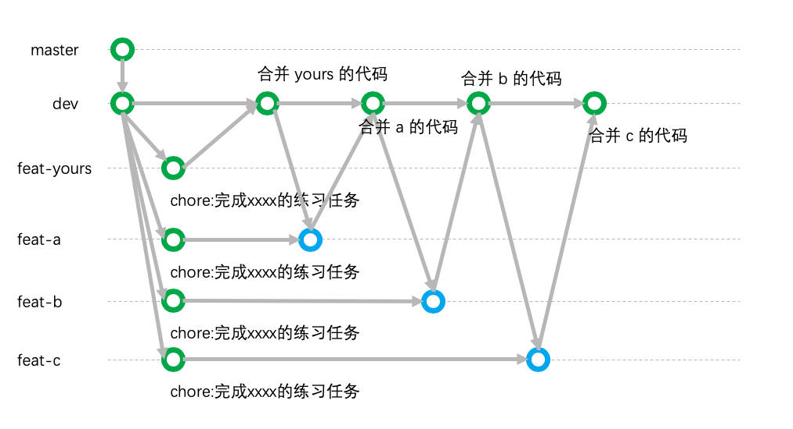

这个图，一定不是你们脑海里期待的样子，你们脑袋里想的大概是这样的：
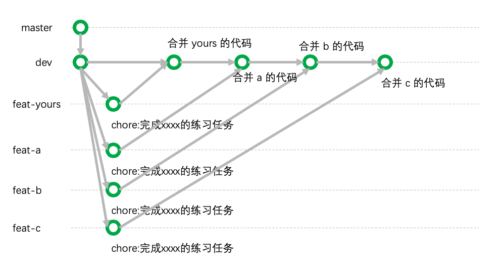
不就是合并到 `dev` 分支嘛，不就是画个点在上面这么简单吗？

这样想也没什么错，关键是你们构想的情况太过于完美了！

## 二、大家的工作过程
我们现在通过文字来复述一下整个工作：你和Tony两个人在完成 `task1`。

回忆我们的 `task1`。

> 注意下面每个动作的 **主语** 是谁。

当 **你** 完成了 `task1` 的时候，**你** 本地 `feat-yours` 分支的 `src/index.html` 的内容如下：
```html
<div class="user">
    <div>me</div>
</div>
<div class="q-a">

</div>
<div class="file-share">

</div>
<div class="duty-scheduling">

</div>
<div class="news">

</div>
<div class="lost-found">

</div>
```

当 **Tony** 完成了 `task1` 的时候，**他** 本地 `feat-tony` 分支的 `src/index.html` 的内容如下：
```html
<div class="user">
    <div>Tony</div>
</div>
<div class="q-a">

</div>
<div class="file-share">

</div>
<div class="duty-scheduling">

</div>
<div class="news">

</div>
<div class="lost-found">

</div>
```

接下来，你将自己的本地的 `feat-yours` 分支 push 到远程仓库上。所以，**远程仓库** 的 `feat-yours` 分支的 `src/index.html` 内容如下：
```html
<div class="user">
    <div>me</div>
</div>
<div class="q-a">

</div>
<div class="file-share">

</div>
<div class="duty-scheduling">

</div>
<div class="news">

</div>
<div class="lost-found">

</div>
```
然后你发起了PR，并由组长审核后，将你 远程仓库的 `feat-yours` 的内容合并至 远程仓库的 `dev` 分支上。

**远程** 的 `dev` 分支在合并前的内容：
```html
<div class="user">

</div>
<div class="q-a">

</div>
<div class="file-share">

</div>
<div class="duty-scheduling">

</div>
<div class="news">

</div>
<div class="lost-found">

</div>
```
**远程** 的 `dev` 分支在合并了 `feat-yours` 之后的内容：
```html
<div class="user">
    <div>me</div>
</div>
<div class="q-a">

</div>
<div class="file-share">

</div>
<div class="duty-scheduling">

</div>
<div class="news">

</div>
<div class="lost-found">

</div>
```
足以见得，现在 **远程** 的 `dev` 分支上的内容，和你本地的内容是一毛一样的。

所以远程仓库现在看起来像这样：
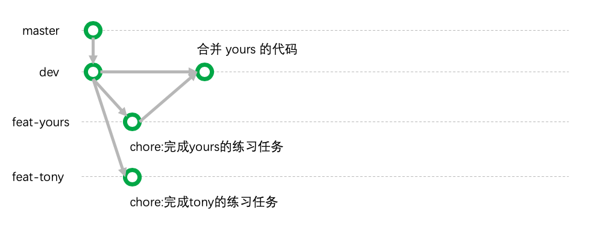

接下来，tony也将他自己的分支 push 到远程仓库上，所以远程仓库上的 `feat-tony` 分支的内容长这样：
```html
<div class="user">
    <div>Tony</div>
</div>
<div class="q-a">

</div>
<div class="file-share">

</div>
<div class="duty-scheduling">

</div>
<div class="news">

</div>
<div class="lost-found">

</div>
```

你现在应该能够想象到，**远程仓库** 上三个分支：`dev`、`feat-yours`、`feat-tony` 的 `src/index.html` 内容分别是什么样的了。

他们最大的区别就在第二行，`feat-tony` 和其他两个分支目前是不一样的：

`feat-tony` 长这样：
```html
<div class="user">
    <div>Tony</div>
</div>
```

`feat-yours` 和 `dev` 长这样：
```html
<div class="user">
    <div>me</div>
</div>
```

这时候，tony发起了`pr`，想要把自己的代码也合并到 `dev` 分支上。

组长 `alice` 审查了 `tony` 的 `pr` ，并准备进行合并。但是，却被系统告知 **合并冲突(merge confilct)**。

如果一切顺利的话，合并是能自动进行的，而现在却不能，原因是有好几种可能性，机器真的不知道你要哪种合并结果：

1. 只要 tony 不要 me

有点像是 tony 本来的任务就是将 `me` 改成 `Tony`
```html
<div class="user">
    <div>Tony</div>
</div>
```

2. 只要 me 不要 tony

有点像是 tony 改了不该改的东西，应该保持原样！
```html
<div class="user">
    <div>me</div>
</div>
```

3. 两者都要

这是我们任务的初衷
```html
<div class="user">
    <div>me</div>
    <div>Tony</div>
</div>
```

4. 两者都要(逆序)

这样也满足我们任务的初衷，只不过有些时候代码先后顺序影响运行效果，到底要哪种呢？
```html
<div class="user">
    <div>Tony</div>
    <div>me</div>
</div>
```

当出现这种情况的时候，机器肯定不能自作主张帮我们进行合并。

这样的合并冲突，需要 **人为地** 进行解决。

组长在处理合并的时候看到这样的代码：
```html
<div class="user">
<<<<<<< feat-tony
    <div>Tony</div>
=======
    <div>me</div>
<<<<<<< dev
</div>
```
会发现多出了很多奇怪的符号，那一排等于号上面的内容代表的是在 `feat-tony` 分支上该文件第2行的内容。那一排等于号下面的内容代表的是 `dev` 分支上该文件第2行的内容。

这时候，组长`alice`就发挥了她组长的作用，去掉了这些奇怪的标记：
```html
<div class="user">
    <div>Tony</div>
    <div>me</div>
</div>
```
并且，这些修改是基于 `feat-tony` 和 `dev` 分支所做的修改，所以产生了一个新的节点在 `feat-tony` 分支上。
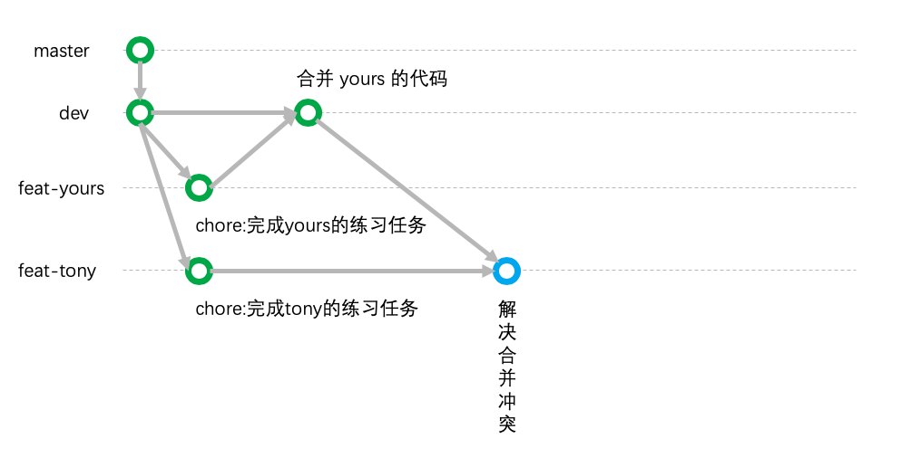

> Q: 什么？为什么这个合并冲突的节点不是产生在 `dev` 分支上？  
> A: 好吧，这是 `github` 的问题，pr是从 `feat-tony` 合并至 `dev` 的，所以如果有合并冲突，需要在原本的分支上去解决。

解决完冲突之后，组长 `alice` 才能真正将 `feat-tony` 分支合并至 `dev` 分支：
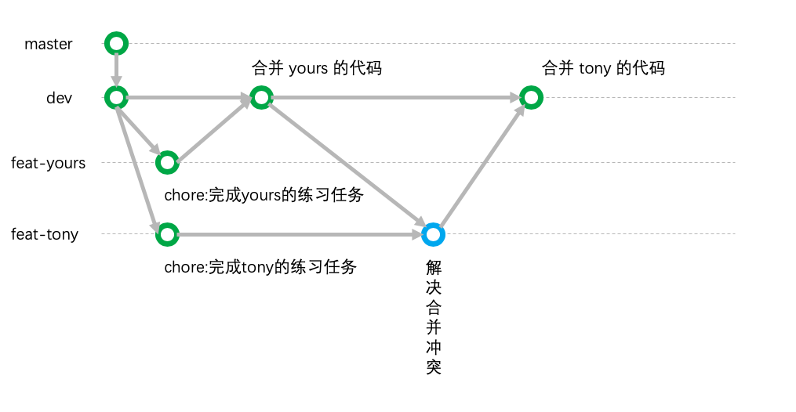

上图中从解决合并冲突到合并，有一些类似于三角形的线路结构，这个结构的出现免不了组长们的辛苦（帮大家解决合并冲突）。

我们可以在 `github` 上的 `insights -> network` 面板看到各个分支的工作情况，也存在着很多这样的线路结构：
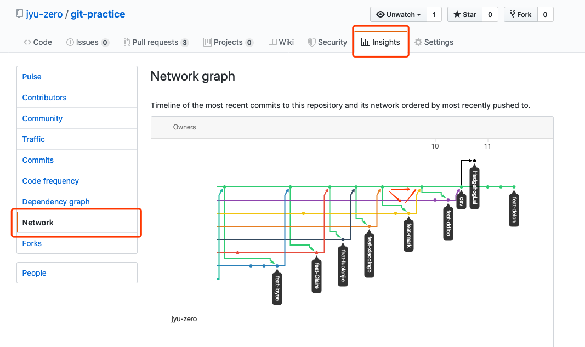

## 三、什么情况不会出现合并冲突？

上文中的这个图代表的就是最完美的情况，每个人各做各的，在最后不会产生任何的合并冲突。

如果我们把 task1 的任务内容改为：
- ~~在 `index.html` 中找到自己的分组并添加自己名字的 `div`~~
- 在 `src` 找到属于自己的分组并且创建一个名为自己的文件

就是不要让大家同时修改同一个文件，这样就不会产生任何冲突啦~因为大家的工作内容都是独立的呢！

在实际情况下，我们力求尽可能少的出现合并冲突，减少组长的痛苦。所以会有一些项目会分开文件夹让不同的分组在各自的文件夹当中工作。


## 四、观察一下你分支底下的 commits 记录吧！
这是今天的主要任务。

1. 在 github 上切换到你的分支
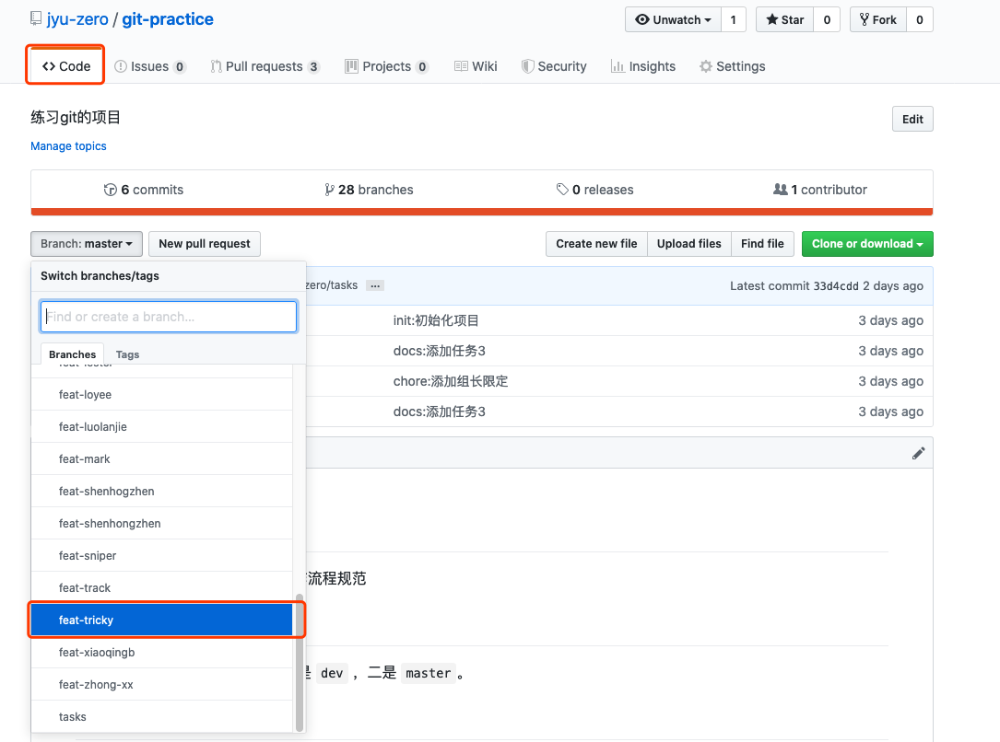

2. 点击 `commits`
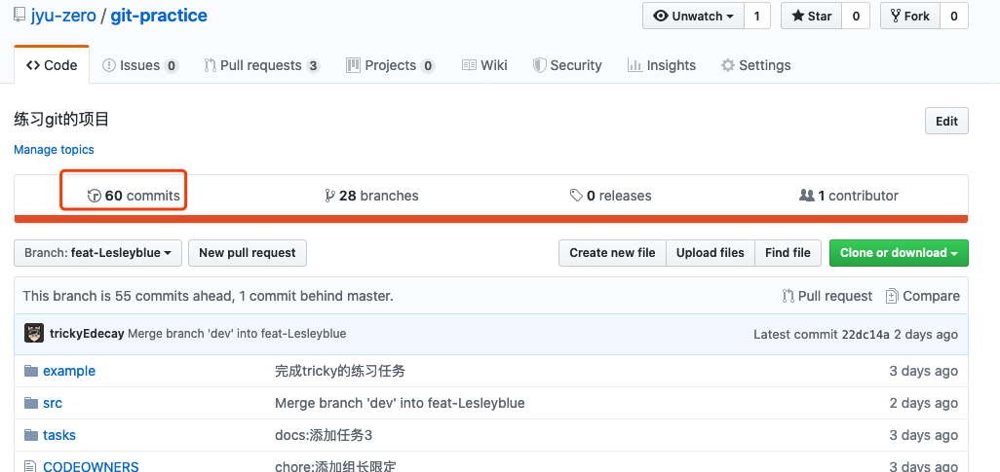

3. 查看所有的 `commits`
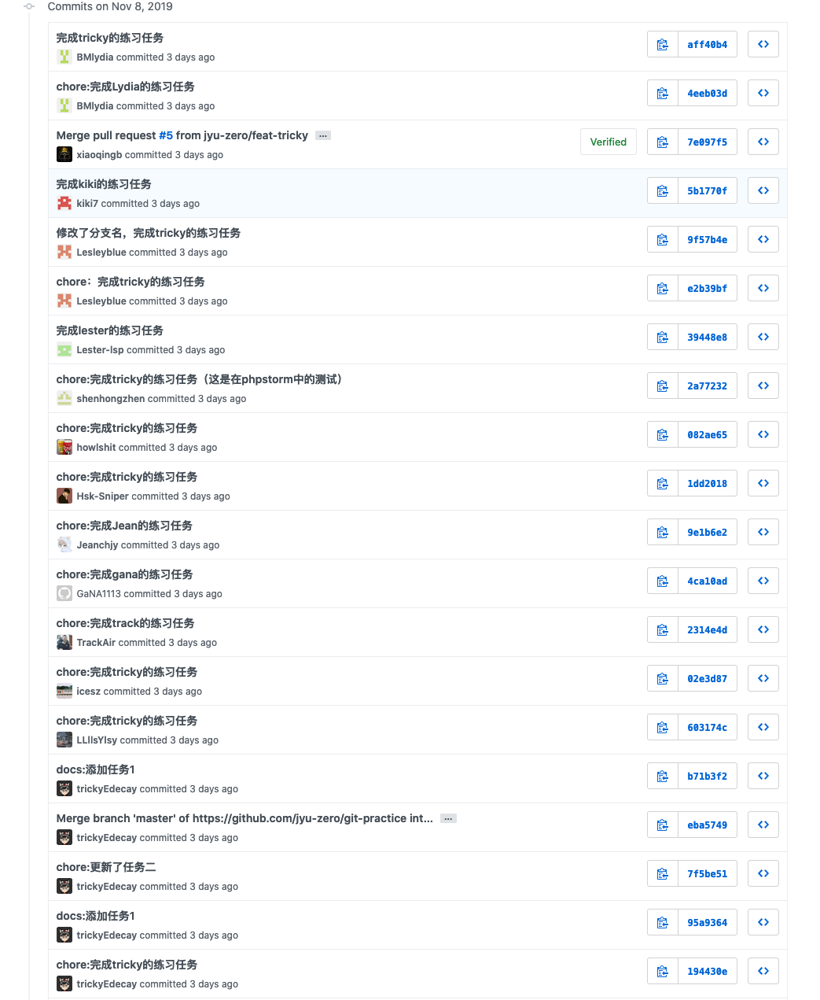

其中，那些以 `Merge pull request ...` 开头的就是组长们辛苦的合并工作。

其他的就是你们自己写的 `commit message` !

那么请问，

**你们在写 `commit message` 的时候按照我们[规定的格式](https://github.com/orgs/jyu-zero/teams/ocp/discussions/1)写了吗？**