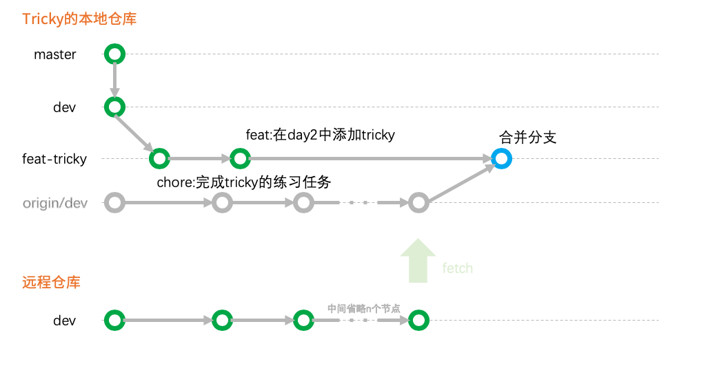

# 让工作同步吧

经历了 [task3](task3.md) 之后，大家所做的修改都体现在了 `dev` 分支上了。


## 一、美好的一天从完成新的功能开始

大家好，我是 tricky， 今天我的工作内容是在 `src/index.html` 当中添加 day2 的开发内容。

1. 在 `<body>` 标签内的底部添加一个 `<div class="day-2"></div>`
2. 在这个新的 `<div>` 当中添加自己的分组的 `<div>`
3. 在自己分组的 `<div>` 当中添加自己名字的 `<div>`

all right,现在我的 `src/index.html` 长这样：

```html
<!DOCTYPE html>
<html lang="en">
<head>
    <meta charset="UTF-8">
    <meta name="viewport" content="width=device-width, initial-scale=1.0">
    <meta http-equiv="X-UA-Compatible" content="ie=edge">
    <title>this is a practice playground</title>
</head>
<body>
    <h1>这里是 dev 分支</h1>
    <div class="example">
        <div>tricky </div>
    </div>
    <div class="user">

    </div>
    <div class="q-a">

    </div>
    <div class="file-share">

    </div>
    <div class="duty-scheduling">

    </div>
    <div class="news">

    </div>
    <div class="lost-found">

    </div>
    <div class="day-2">
        <div class="example">
            <div>tricky</div>
        </div>
    </div>
</body>
</html>
```

当我写完之后进行了一次 `commit`。

## 二、好像做错了什么

在tricky进行了commit之后，他的本地仓库和远程仓库分别长这样：


因为我们从来没有做过从远程仓库同步到本地的操作，所以，tricky `本地的dev` 分支看起来真的比 `远程的dev` 分支落后很多很多。

而且，因为今天做了新的事情，tricky `本地的 feat-tricky` 分支看起来比 `远程的 feat-tricky` 分支“领先”了一个版本。

回头想想，**觉得事情不是很对**。

在 `远程的dev` 分支上，`src/index.html` 这个文件已经密密麻麻地写上了大家的名字，而在 tricky 本地，却没有一个任何分支的 `src/index.html` 文件是写着大家密密麻麻名字的。

我们应该认为，`远程的dev` 分支上的内容是我们最终想要的内容，以后所有的开发都应该基于 `远程dev` 分支的 **最新版本** 进行开发的。

也就是说，tricky今天不小心在tricky自己之前的版本上进行了开发！

## 三、补救
基于上面的问题，目前 tricky 要做的事情就是，让他的 `src/index.html` 拥有 `远程dev` 分支现在的代码，并且要附属上刚刚自己写完的 `day2` 的代码。

所以，他在 VSCode 上：

> phpstorm 的操作方法参照下文的第五章节，但是建议先看完这一个章节

1. 他处在自己的分支 `feat-tricky` 上
2. 在 git 面板找到 `pull from` 命令


3. 在弹出来的窗口中选择远程仓库主机 `origin`


4. 接下来，VSCode 会询问你想要拉取哪个分支，我们选择 `origin/dev` 分支

意思是将 `远程的dev` 拉取到本地，对当前分支(`feat-tricky`)进行合并。

VSCode 的这一步操作实际上是做了这些事情：
- 将 `远程dev` 分支拉取到本地的 `orgin/dev` 分支。(俗称远程分支本地副本)
- 将 `origin/dev` 分支和 `feat-tricky` 进行合并操作(有可能会产生冲突的哦)
- 合并之后会产生一个新的 `commit` 节点在 `feat-tricky` 分支上。

> 所以，第2步菜单中的 `pull` (没有 from 那个)，它默认是拉取远程的同名分支到本地。 

所以画成图大概是这样：


这样一来，上图的蓝色节点既包含了来自最新的 `远程dev` 分支的代码，也包含了 `tricky` 今天刚刚加入的代码！

## 三、结束今天的工作

tricky 完成了今天所有的工作，并且把自己的分支 push 到了自己的远程分支上[(重复task1的内容)](task1.md)。

在这之后，发起一个 `PR`，请求将自己今天所做的修改合并到 `远程dev` 分支上[(重复task3的内容)](task3.md)

## 四、排到大家啦

不难猜到，我们今天的主要任务是要在 `day2` 里面找到或创建自己的分组，并放入自己的名字。

但是呢，`day2` 这一块不需要由你们重新再写过了。因为 `tricky` 已经写过了。

你们需要做的事情是：

1. 拉取 `远程的dev` 到你们的本地；
2. 将 `origin/dev` 分支合并至你们本地自己的分支；
3. 类似于task1的任务，添加自己的分组、名字；
4. push自己的分支到远程仓库；
5. 发起 pr；
6. 等待审核与修改错漏内容；

其中的第1、2步参考上文中的内容。

## 五、phpstorm 的操作方法
让我们把时间点回到 tricky 刚 commit 完今天的工作内容(第三章)，正在寻找补救措施。

1. tricky 处在自己的分支上 `feat-tricky`
2. 在菜单栏找到 `VSC->Git->Pull`


3. 在弹出的窗口中选择用于合并当前分支的远程分支，那肯定是选 `orgin/dev` 啦~然后点击 `Pull`


4. 完成啦~


## 六、总结
在项目开发当中，由于我们要求一天每个人至少1天提交1次PR，意味着我们第1天结束时，远程的 `dev` 分支会迎来很多新的功能。

在你开始第二天的项目之前，你应该将远程 `dev` 分支上的内容拉取到你本地自己的分支上，然后进行你的开发。

当然，在你进行开发的过程中，难免会出现 `远程dev` 分支又更新了的情况。所以，我们要养成一个好习惯：

在 push 自己的分支之前，先将 `远程的dev` 分支拉一下，不管有没有新的内容。

你的一天看起来就像：
1. pull `远程dev` 合并到自己的分支上
2. 进行开发、commit、commit
3. pull `远程dev` 合并到自己的分支上
4. push 自己的分支到远程仓库自己的分支上
5. 发起 PR
6. 继续开发、commit、commit
7. pull `远程dev` 合并到自己的分支上
8. push 自己的分支到远程仓库自己的分支上
9. 发起 PR  
...

**总而言之，在你开始工作前、push之前都各自进行一次 pull 吧！**

**完结撒花！🎉🎉**